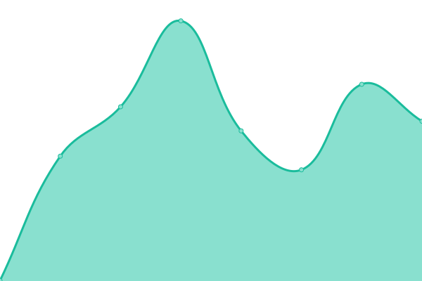

### [📈 Live Status](https://status.deniz.blue): <!--live status--> **🟧 Partial outage**

<!--start: status pages-->
<!-- This summary is generated by Upptime (https://github.com/upptime/upptime) -->
<!-- Do not edit this manually, your changes will be overwritten -->
<!-- prettier-ignore -->
| URL | Status | History | Response Time | Uptime |
| --- | ------ | ------- | ------------- | ------ |
|  [Homepage](https://deniz.blue) | 🟩 Up | [homepage.yml](https://github.com/deniz-blue/upptime/commits/HEAD/history/homepage.yml) | 

 316ms
     
 | 

<a href="https://status.deniz.blue/history/homepage">100.00%</a>
    

|  [Events](https://events.deniz.blue) | 🟥 Down | [events.yml](https://github.com/deniz-blue/upptime/commits/HEAD/history/events.yml) | 

 177ms
     
 | 

<a href="https://status.deniz.blue/history/events">0.00%</a>
    

<!--end: status pages-->

[**Status website →**](https://status.deniz.blue)

_powered by: [Upptime](https://github.com/upptime/upptime)_
