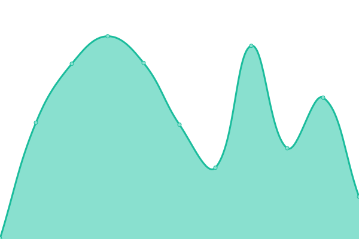
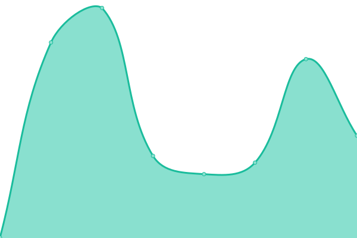
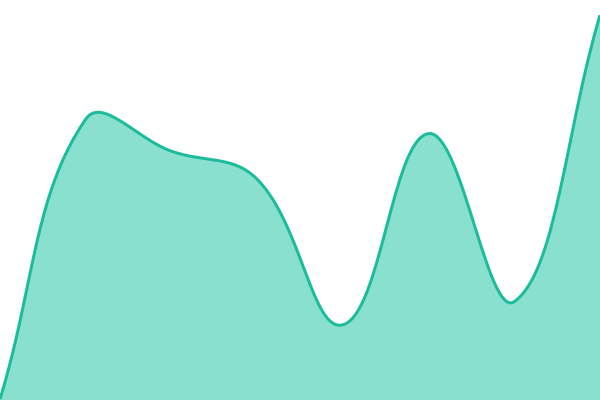

### [📈 Live Status](https://status.deniz.blue): <!--live status--> **🟧 Partial outage**

<!--start: status pages-->
<!-- This summary is generated by Upptime (https://github.com/upptime/upptime) -->
<!-- Do not edit this manually, your changes will be overwritten -->
<!-- prettier-ignore -->
| URL | Status | History | Response Time | Uptime |
| --- | ------ | ------- | ------------- | ------ |
|  [deniz.blue](https://deniz.blue) | 🟩 Up | [deniz-blue.yml](https://github.com/deniz-blue/upptime/commits/HEAD/history/deniz-blue.yml) | 

 294ms
     
 | 

<a href="https://status.deniz.blue/history/deniz-blue">100.00%</a>
    

|  [Deniz's Events Site](https://events.deniz.blue) | 🟥 Down | [deniz-s-events-site.yml](https://github.com/deniz-blue/upptime/commits/HEAD/history/deniz-s-events-site.yml) | 

 3726ms
     
 | 

<a href="https://status.deniz.blue/history/deniz-s-events-site">97.78%</a>
    

|  [eventsl.ink](https://eventsl.ink) | 🟩 Up | [eventsl-ink.yml](https://github.com/deniz-blue/upptime/commits/HEAD/history/eventsl-ink.yml) | 

 230ms
     
 | 

<a href="https://status.deniz.blue/history/eventsl-ink">100.00%</a>
    

|  [evnt.directory](https://evnt.directory) | 🟩 Up | [evnt-directory.yml](https://github.com/deniz-blue/upptime/commits/HEAD/history/evnt-directory.yml) | 

 304ms
     
 | 

<a href="https://status.deniz.blue/history/evnt-directory">100.00%</a>
    

|  [Vantage](https://vantage.deniz.blue) | 🟩 Up | [vantage.yml](https://github.com/deniz-blue/upptime/commits/HEAD/history/vantage.yml) | 

 233ms
     
 | 

<a href="https://status.deniz.blue/history/vantage">100.00%</a>
    

<!--end: status pages-->

[**Status website →**](https://status.deniz.blue)

_powered by: [Upptime](https://github.com/upptime/upptime)_
